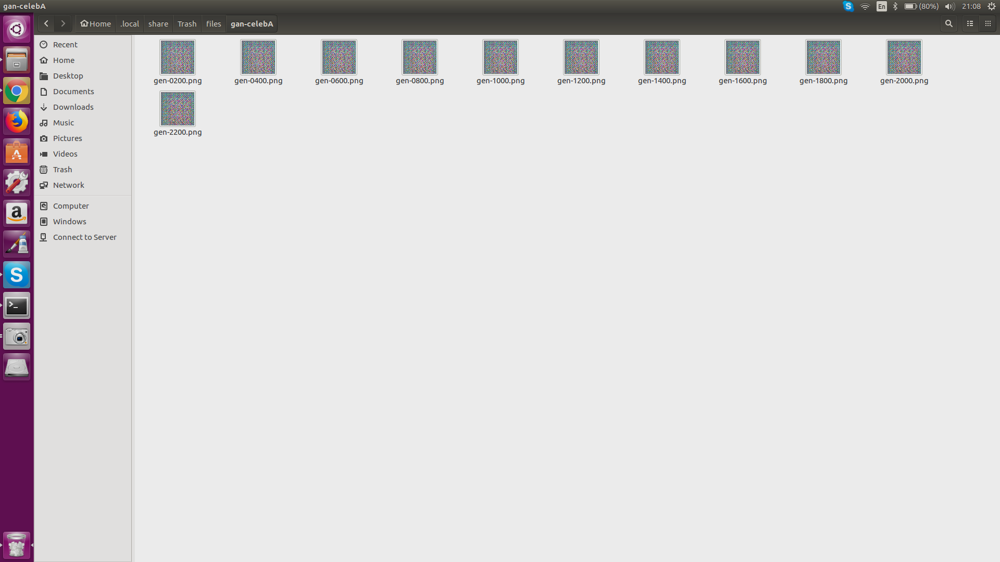

# DCGAN-keras
One can download the celebA dataset from, for example, [kaggle](https://www.kaggle.com/jessicali9530/celeba-dataset).

After unzip the dataset file, there should be a folder called `img_align_celeba`, point the path `celebA_path` in the python code to the path of your downloaded `img_align_celeba`. After this, I think one can proceed to run the `kh5_carpedm20.py` code.

#### Rmk.
- I did not find the time to include a `requirements.txt` file for the python packages, but they are just some standard packages described in the import part of the code like `keras`, `pillow`, etc.

- Windows users might find the printed stdout annoying; if so, simply delete all print involving `bcolor`. I think that only works under linux.

### The one I search to fix
    
### What simpler model can achieve
    
### What carpedm20's model should achieve

